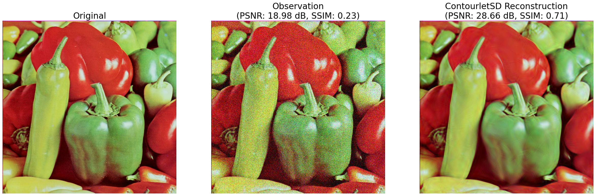

# A New Contourlet Transform with Sharp Frequency Localization

### [[Paper]](https://lu.seas.harvard.edu/files/contourletsd.pdf) This is the PyTorch implementation of ContourletSD: A New Contourlet Transform with Sharp Frequency Localization

[Yue M. Lu](https://lu.seas.harvard.edu/)<sup>1</sup>,
[Minh N. Do](https://minhdo.ece.illinois.edu/)<sup>2</sup><br>
<sup>1</sup>Harvard University, <sup>2</sup>University of Illinois at Urbana-Champaign

### Dependencies.
For a full list of requirements, please refer to ***requirements.yml***. To install the dependencies, install [mini-conda](https://docs.conda.io/en/latest/miniconda.html) and execute:

```bash
conda env create -f requirements.yml
```

### Getting Started.
Our contourlets implementation is based on native PyTorch and allows fast access to directional multiresolution image representations.

The ContourletSD library and helper functions can be imported as:
```python
import torch
from torchvision.io import read_image

from contourletSD_pytorch.contourlet_ops import (get_norm_scaling, hard_thresholding)
from contourletSD_pytorch.contourlet_sd import ContourletSD
from utils.smooth_functions import VALID_SMOOTH_FUNC
```

The contourlet analysis and synthesis operators can be used via the `ContourletSD` class:
```python
contourlet_sd = ContourletSD(
    nlevs=[2, 2, 3, 4, 5],
    Pyr_mode=1,
    smooth_func=VALID_SMOOTH_FUNC['rcos'],
    dfilt='pkva',
    color_mode='rgb',
)
```

After reading an image and generating its noisy version:
```python
X = read_image('datasets/test_images/peppers_color.png').unsqueeze(0).to(torch.float)
Xn = X + 30.0 * torch.randn_like(X)
```

Denoising via contourlet hard thresholding can be performed as:
```python
# Get contourlet coefficients.
Y = contourlet_sd(x=Xn)

# Load pre-computed norm scaling factors for each subband.
E = get_norm_scaling(
    image_size=Xn.shape[-1],
    SDmm_dir='extras/sdmm_matlab',
    Pyr_mode=1,
    device=Xn.device,
)

# Apply hard thresholding on coefficients.
Yth = hard_thresholding(
    y=Y,
    sigma=30.0,
    E=E,
)

# Reconstruct image.
Xd = contourlet_sd(
    x=Yth,
    reconstruct=True,
)
```
Results:



### Demos.
The *scripts* subfolder includes bash scripts to run denoising demos on CPU and CUDA if available. To run the CUDA demos, the [Set12](https://drive.google.com/file/d/1cpQwFpNv1MXsM5bJkIumYfww8EPtlkWf/view?usp=sharing) and [Color Berkeley Segmentation (BSDS300)](https://www2.eecs.berkeley.edu/Research/Projects/CS/vision/bsds/) datasets must be included in the *datasets* subfolder.

### References.
If you use this code or find it helpful, please consider citing:
<pre>
@inproceedings{lu_2006_new,
  title={A new contourlet transform with sharp frequency localization},
  author={Lu, Yue and Do, Minh N},
  booktitle={2006 International Conference on Image Processing},
  pages={1629--1632},
  year={2006},
  organization={IEEE}
}
</pre>
